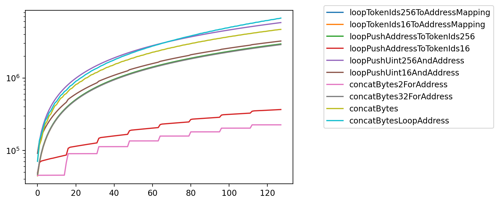

# Benchmarking gas usage for minting ERC721 tokens

In this article, we will benchmark the gas usage of the `mint` function of several `ERC721` contracts.
Before we go directly to the complex interface an ERC721 should implement, we start with some
basic function calls to get an idea of what will cost gas.
Eventually we will benchmark OpenZeppelin's implementation against some other ones claiming lower minting
fees on the internet. Feel free to reach out and to benchmark yours as well!

### Writing batch indexes

In a _mint_ call, there are essentially three things that happen:

- checking that the tokens to be minted do not exist yet
- writing the new indexes into storage
- storing who they belong to

All the other things that happen should not take place during a minimal mint process but rather should
be delayed to some other calls not paid for by the minter.

We first study the gas cost of storing a batch of indexes into the storage of a contract, without any other checks or actions.
We compare this using `uint16` (`bytes2`) or `uint256` (`bytes32`) for the token index. Indeed the vast majority of tokens do not exceed
the `uint16` limit (65536 items). We also compare the usage of the native `bytes` array type with the more complex `uint[]` one.
Eventually we compare:

- `abiEncodeConcatBytes2`: use `abi.encodePacked` to concatenate the bytes of the indexes using byte2 for each index
- `abiEncodeConcatBytes32`: use `abi.encodePacked` to concatenate the bytes of the indexes using byte32 for each index
- `concatBytes2`: use `bytes.concat` to concatenate the bytes of the indexes using byte2 for each index
- `concatBytes32`: use `bytes.concat` to concatenate the bytes of the indexes using byte32 for each index
- `loopConcatBytes2`: use `bytes.concat` to concatenate iteratively an array of bytes2
- `loopConcatBytes32`: use `bytes.concat` to concatenate iteratively an array of bytes32
- `loopPushUint16`: use `uint16[].push` to iteratively push each index as a uint16
- `loopPushMemoryUint16`: use a temporary memory `uint16[]` to concat previous and new indexes, then replace the storage
- `loopPushUint256`: use `uint256[].push` to iteratively push each index as a uint256
- `loopPushMemoryUint256`: use a temporary memory `uint256[]` to concat previous and new indexes, then replace the storage


{#write_batch_indexes }


For a batch size of 128, one has:

```
abiEncodeConcatBytes2      225571
concatBytes2               225579
loopPushMemoryUint16       349939
loopPushUint16             357561
loopConcatBytes2           616848
abiEncodeConcatBytes32    2891405
concatBytes32             2891413
loopPushMemoryUint256     2931751
loopPushUint256           2940451
loopConcatBytes32         6098097
Name: 127, dtype: int64
```


This plot leads to the following comments:

- the `bytes.concat` and `abi.encodePacked` options are indistinguishable from each other
- they are the less expensive ones with almost flat fees from writing up to 128 indexes in this benchmark
- surprisingly enough, using `uint16` with a naive loop for the token IDs is the second best option, much
  cheaper than `uint256`. Since most of the collections don't have more than 10k items, this seems a very
  reasonable tradeoff to make without any other changes.
- the `uint256` option used in the standard OZ implementation is much most expensive by a large margin
- looping over `bytes32` to `bytes.concat` is a complete non-sense in this context but it's worth mentioning its gigantic gas usage
- using a temporary `uint[]` array instead of pushing directly into the storage does not bring any benefit here


### Saving the owner address

The previous benchmark studied the most effective way to store new token ids. When minting, one also has to
store the address of the tokens' owner. Actually, the _honest minter_ should not pay for more than this, i.e. storing in the
blockchain that he owns some token Ids. By honest, we mean the minter that does it right:

- does not try to mint someone else's token
- strive to comply with the contract's expectation.

Indeed, we think that the honest minter should ideally not pay for more because of some other malicious users. They also
should not pay for optimizing the view cost of the token. Eventually the honest owner knows what he owns and is
probably not paying for the gas costs of the view calls.

Eventually we compare:

- `concatBytes2ForAddress`: use a mapping owner address -> bytes with 2 bytes per token id
- `concatBytes32ForAddress`: use a mapping owner address -> bytes with 32 bytes per token id
- `loopPushAddressToTokenIds16`: use a mapping owner address -> uint16[] to store the token ids
- `loopPushAddressToTokenIds256`: use a mapping owner address -> uint256[] to store the token ids
- `loopTokenIds16ToAddressMapping`: use a mapping uint16 -> owner address
- `loopTokenIds256ToAddressMapping`: use a mapping uint256 -> owner address
- `loopPushUint16AndAddress`: use two arrays to store the token ids (`uint16`) and the owner address
- `loopPushUint256AndAddress`: use two arrays to store the token ids (`uint256`) and the owner address
- `concatBytes`: use two bytes arrays to store the token ids (`bytes32`) and the owner address
- `concatBytesLoopAddress`: use two bytes arrays to store the token ids (`bytes32`) and the owner address, looping over the owner address


{#write_batch_indexes_and_addresses }


For a batch size of 128, one has:


```
concatBytes2ForAddress              225756
loopPushAddressToTokenIds16         367112
concatBytes32ForAddress            2891590
loopTokenIds256ToAddressMapping    2919401
loopTokenIds16ToAddressMapping     2924648
loopPushAddressToTokenIds256       2949943
loopPushUint16AndAddress           3238992
concatBytes                        4687382
loopPushUint256AndAddress          5823195
concatBytesLoopAddress             6716756
Name: 127, dtype: int64
```


Once again we see that restricting the tokenId to be a `bytes2` (or even `uint16`) gives a major improvement in the gas usage. However we
see that
this improvement is not visible when the tokenId is used as a key in a map.

Regarding the usage of mappings, we see that a mapping from `uint256` to owner `address` is not more expensive than a mapping
from owner `address` to `uint256[]`. This is probably because the gas usage of pushing into a `uint256` is very high as we saw
previously.

It is also worth noticing that storing in two _parallel_ arrays the tokenIds and the owner addresses is way less effective than
using a mapping from tokenId to owner address. This is especially visible for tokenIds using `uint256`.

Overall, we see that when using `bytes` as an array and restricting the tokenIds to their minimum size, (for instance `uint16` instead of
`uint256` for 10k PFP collectibles) is real game changer in the minting process. As an illustration, we have this latter implementation
being 13 times more efficient than the
standard
OZ ones.

Eventually we also clearly see that the EVM works by slots of 32 bytes, thus using `bytes2` for the token ids makes it almost free to
mint by batches of up to 16.

### Checking first that the token does not exist

While we were talking about an _honest_ minter that would strive to push only the relevant data to the contract as a baseline for
acceptable fees, we still need to make sure that their don't try to mint either an existing token, or twice the same. Since the
way this existence check is performed depends on the core implementation of the contract, we add this third check to our benchmark.
For the following benchmark we need to simulate the fact that the contract has an increasing number of token so that the performing
the existence check is close to reality.

Thus the following experiment:

- uses a total of 20 users
- iteratively mints a token to the contract storage
- estimates the gas usage of minting a batch of 128 tokens

Thus compared to the previous graph, we do not make the batch size change but we add the complexity for the existence check.
The results are as follows:


{#check_write_indexes_addresses }


Final results read from the graph:


```
concatBytes2ForAddressBoolIndexes          446794
loopPushAddressToTokenIds16BoolIndexes     555231
loopTokenIds256ToAddressMapping           1491763
loopTokenIds16ToAddressMapping            1497032
concatBytes2ForAddress                    2047878
loopPushAddressToTokenIds256              2737738
concatBytes32ForAddress                   3477337
loopPushAddressToTokenIds16               7166309
Name: 63, dtype: int64
```


Once again, we see that restricting the tokenId to be a `bytes2` (or even `uint16`) gives a major improvement in the gas usage.

### The IERC721Enumerable interface

We now consider the IERC721Enumerable interface and discuss its possible optimized implementations with respect to the previous
conclusions.

#### Events

Events should be emitted in the following cases:
Events:

- `Transfer`
- `Approval`
- `ApprovalForAll`

Since these events are part of the specification, we cannot do too much about them and the minting
cost associated with them will increase linearly with the batch size. For a single token we have:

```
emitTransfer          23767
emitApproval          23811
emitApprovalForAll    23841
dtype: int64
```


As we can see emitting these events is not free at all. The developer and the community should really ask themselves if the user
should pay for these events they are not even aware of. On this topic we find ourselves close to the position given in
[The Gas-efficient way of building and launching an ERC721 in 2022](
https://nftchance.medium.com/the-gas-efficient-way-of-building-and-launching-an-erc721-nft-project-for-2022-b3b1dac5f2e1)

#### Full implementation

We now benchmark full implementations of the IERC721Enumerable interface. So far we have:

- OpenZeppelin's standard implementation
- Azuki's ERC721A implementation. Note that this implementation is not strictly equivalent as it does not allow unordered token ids
- A proposed implementation based on a "ask don't compute principle"


{#mint_batch }
