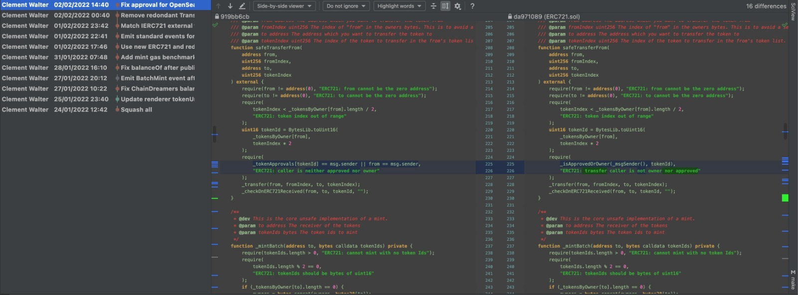
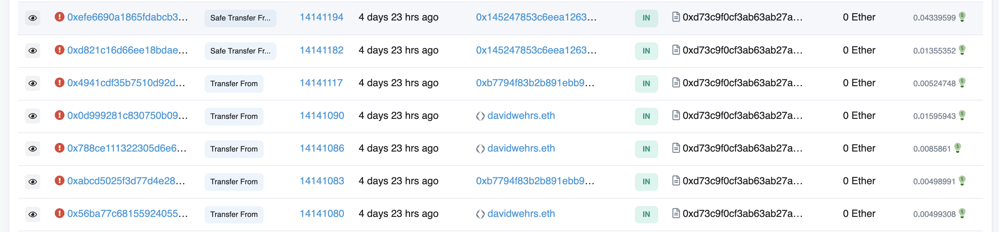

# The single-line error that was worth 4 ETH

Yes, 4 ETH, or more precisely 4,09337014 ETH, which was worth, at the time of fixing the bug, 12,516.22 US$. How all
this happened with one single line of code updated 4 hours before the launch? This is the post-mortem of the bug.

## Context

The project I was working on was called the [chaindreamers](https://chaindreamers.xyz). We had the ambition to build
something new on top of the [chainrunners](https://chainrunners.xyz), both in terms of narrative and in terms of the
technology we used for the on-chain rendering. After several weeks of work, we had a working prototype of our unique
100% on-chain vector based encoding and rendering scheme. So we decided to move forward with the launch of the project.

Because of the nature of the project, we didn't have, like most of the NFT projects, a whitelist mechanism. Instead, we
wanted each Runner to be turned into its own Dreamer counterpart. So the whitelist was actually the 3k runners' holders.

However, looking at the distribution of the runners' holders, we noticed that some people had more that hundreds of
them. So we were facing something new: our contract had be optimized against massive batch minting. 10 days before the
mint, I started a comprehensive study of gas usage when minting an ERC721 or ERC721Enumerable
contract. [This repo](https://github.com/ClementWalter/gas-benchmark) is the result of this study.

## The new ERC721 implementation

The above-mentioned study showed clearly that there are two main directions for optimizing an IERC721 implementation:

- using `uint16` or `bytes2` for the tokenIds
- using `mapping(address => bytes)` (or `mapping(address => uint16[])`) as a single source of truth for the tokenIds and
  ownerships.

Looking at the exact specs of the IERC721 and IERC721Enumerable contracts, it seemed rather clear that is was completely
possible and indeed rather easy to build a new implementation from scratch around this backbone.

On my way to this new implementation I started to think about the usual memory / computation tradeoff when programming
and the gas usage paid for by the minter. For the batch minting fees to be as low as possible it was necessary to really
cut off all the non-strictly required computation. By non-strictly required, I mean "all these computations that are not
strictly required to store that user _0x..._ is about to own tokens _n, m, ..._".

I thus came with the following guidelines:

- put as much computation as possible on the `external view` functions
    - these functions are meant to be called off-chain so we don't care about its gas usage
- check but _never_ compute in the `internal` (paid) functions
    - for example if a function requires to find the index of an item in an array, better ask for both the item and the
      index in arguments and only check that the index actually returns the item.

And I still believe that it should be so!

But yet we are not alone in the Ethereum metaverse.

## The OpenSea registry optimization

It is now well known that a link to the OpenSea registry has to be added to any ERC721 token to avoid the user to pay an
approval fee before listing the token. It's well know but well, when it's you first token it's always a bit confusing,
isn't it?

So here we are, struggling with the OpenSea registry implementation, the night before the mint, realizing on the testnet
that it was not possible to conclude a deal on OpenSea with our current custom implementation.

After the night before, well, this is the day of the mint right? So here we are, few hours before the mint, still
wondering why OpenSea would list but not eventually transfer the token after a purchase. "Error, reverted with reason:
..."
with no reason displayed.

Complex problem with an easy solution indeed: even though I set properly the registry and used it accordingly in the
`isApprovedForAll` function, it was failing during the `transferFrom` because here, _in my custom implementation_, I was
not using the `isApprovedForAll` function but directly the `tokensApproval` mapping.

## The 4 ETH line

Once that was clear, I happily copied/pasted the slight modification from the OZ's implementation and it worked. In the
meantime I didn't notice that I was introducing a very (very) gassy function call to the `transferFrom` function.

Of course any dev around knows that it is not a good idea to update the codebase so close to the launch of the project.
However, thanks to the hundreds of test I had, I was pretty confident that the change was not too much of a problem. And
it actually works!

After the project was launched, runners started to mint and we were pretty happy with the results. Two days later, we
decided to open to the public. 6pm on Friday evening, getting ready with bears and pop-corns, I confidently updated
through etherscan the state of the contract. And started to refresh the transaction history tab to monitor the mint.

Soon after the opening, a batch of failed transactions appeared on etherscan, all of the same kind: transfer. Trying to
do one as well with custom high gas fees, it was still failing. One hour later, I figured out that the single change
made for OpenSea just killed the ability to eventually transfer tokens because of gigantic gas fees.

Indeed, the test before the launch worked fine because I was not testing with a lot a token already minted. However
my `ownerOf` implementation had a gas cost increasing with the number of owners and the number of existing tokens.

Ironically enough, I knew that this implementation was not great and I especially wrote for `@dev`:

> This is the public ownerOf, see IERC721. We fail fast with the initial check. There is no good reason to call this
> function on chain.

and in its internal implementation `_ownerOf`:

> For each owner, we go through all their tokens and check if the sought token is in the list. This lookup is gassy
> but we do not expect to pay them often as we provide other mean of doing the transfers.

I spent a day figuring out if I would go for a fix or using the standard OZ implementation to avoid any other edge
cases. Noticing that no one was really batch minting our Dreamers (too bad!) and facing the fear of another bug, I
decided to go for the most robust contract and redeployed a standard ERC721Enumerable. Thus, instead of at least once
taking the benefits from batch minting, I was forced to pay the huge amount of gas fees I was from the beginning trying
to make the others avoid! Eventually, air dropping the 500 already minted tokens costed approximately 4 ETH...

## Conclusion

We are all here to learn and this was our very first live collection on ethereum!
The main takeaways are:

1. test should not only test the behavior of the function but also its gas usage under realistic conditions
2. functions that are not meant to be called on-chain should be marked as `external`. This may have rung a bell
3. re-deploying the same optimized contract with a fix would have cost probably ten times less (given the benchmark). No
   good decision is taken under pressure!

I will keep updating this repo with optimized contracts and strive to minimize the gas cost for the end user. Everyone
is more than welcome to jump in and publish either their contract for benchmarking or work on tools and other things.
The end goal is to create a steady gas benchmarking tool for the EVM and keep a track record of the money saved to the
users!
